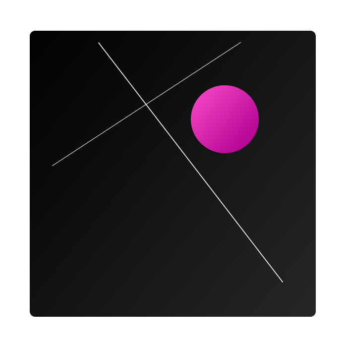
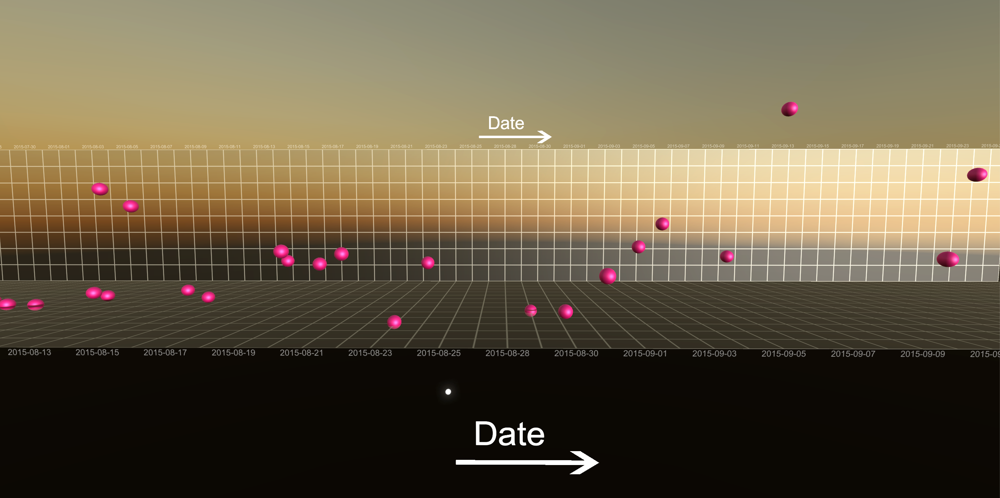
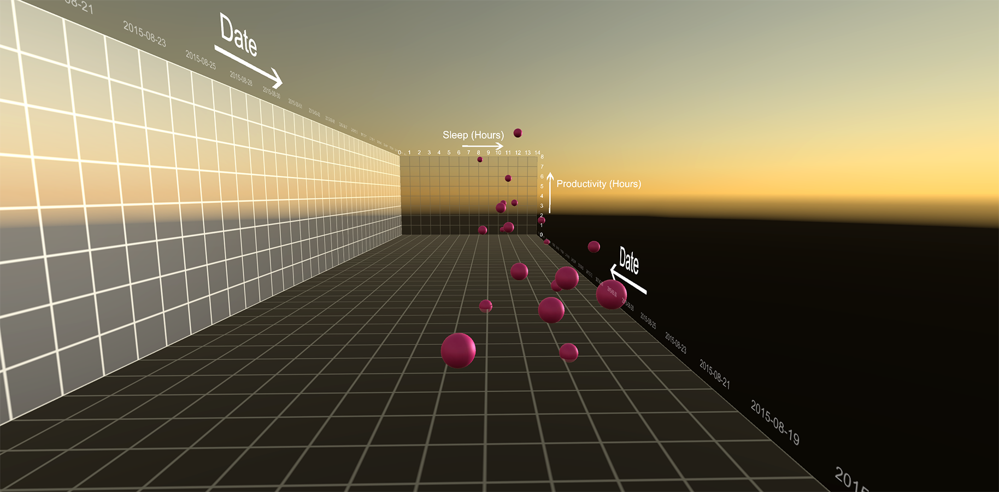
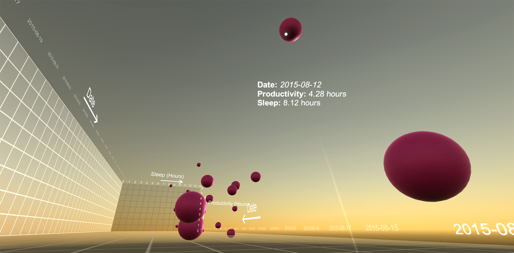
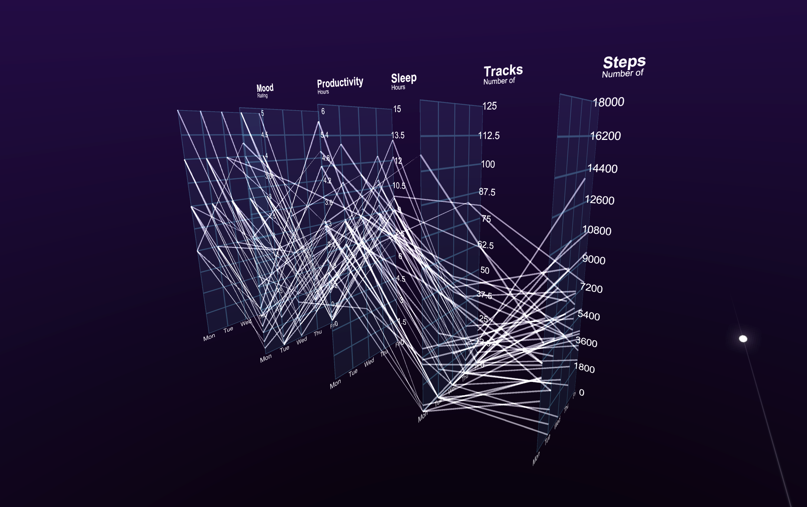
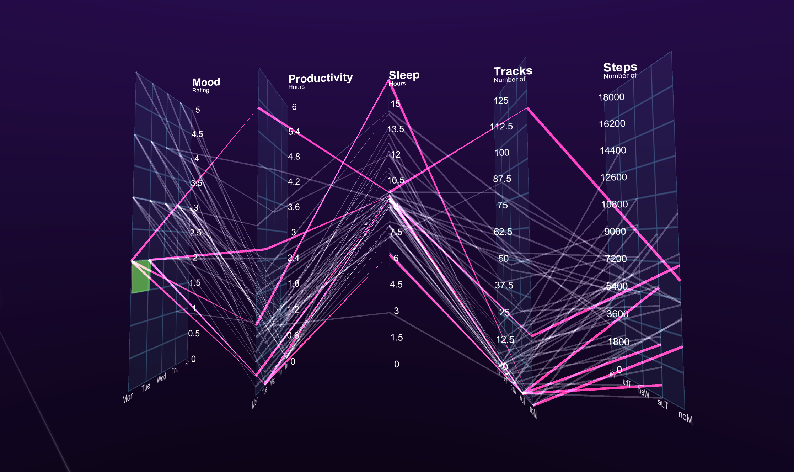
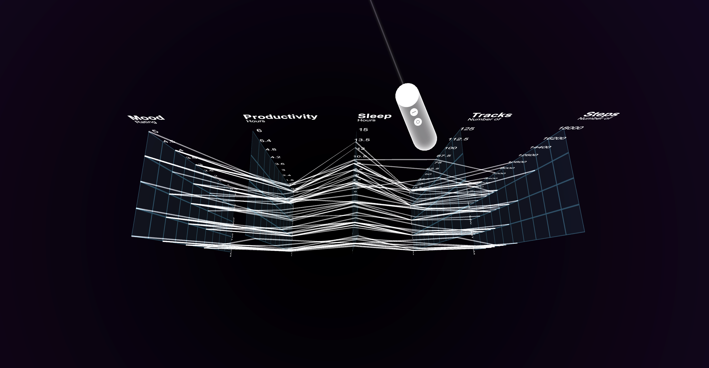

# Visualisation & Exploration of Personal Data in Virtual Reality

> This repo is intended as a showcase for my final year dissertation completed at the University of Bath. The project received a strong first and ranked amongst the highest-marked dissertations in the year.

#### Experience Quick Links

<table>
  <tbody>
    <tr>
      <td>
      <td width="200px" align="center"> <a href="#BTD"> Be The Data </a></td>
      <td>
      <td width="200px" align="center"> <a href="#PP"> Parallel Planes </a></td>
    </tr>
  </tbody>
</table>

<a href="mailto:patrickmillais@gmail.com?Subject=Personal%20Data%20Visualisation%20In%20VR">Get in touch</a> if you are interested in reading more.

Abstract
--------
Recent research in the personal informatics field has focused on correlating aspects of self-tracked data, supporting users to arrive at meaningful insights when reflecting on aggregated datasets. To date, no research has been completed on how users could explore personal data using virtual reality, and the opportunities this presents for users’ understanding of multidimensional datasets.

In this study we evaluate the open-ended exploration of multidimensional datasets using two separate visualisations. *Be The Data* immerses users in a three-dimensional scatter plot, allowing them to interpret a dataset from new perspectives. The second visualisation, *Parallel Planes*, enables a multi-faceted dataset to be chained together, supporting users in perceiving a holistic overview of interrelated dimensions.

Through an insight-based evaluation methodology, we find that users conducted depth-based explorations of the Parallel Planes visualisation, arriving at valuable and significant insights through hypothesising about the data. We also find that there was no overall task-workload difference between traditional visualisation paradigms and virtual reality. We conclude by outlining future research directions, and making recommendations for future evaluation approaches for data visualisation in VR.

Project Outline
--------

* **Chapter 1**: Introduces the motivation behind the project, the exploratory nature of the work and specific aims and contributions delivered by the dissertation.

* **Chapter 2**: Extensive literature review exploring three broad themes: personal informatics, data visualisation and virtual reality. Two visualisation techniques are identified for transposing to, and evaluating in, a new visualisation paradigm: *Be The Data* & *Parallel Planes*.

* **Chapter 3**: Investigation of the mobile VR domain leading to the selection of Google Daydream as the target prototyping platform. Scoping and initial requirements elicitation from a multitude of sources.

* **Chapter 4**: Data pre-processing with Python, key design considerations around movement & interaction made during the protototyping process. Overview of prototype creation using C# and Unity with the Google Daydream platform. Realism and challenges of visualising self-quantified data. 

* **Chapter 5**: Visual demonstration of the design and functionality of the final prototype designs.

* **Chapter 6**: Experimental design research, formalisation of research questions, pilot study, hypotheses, format, and strategies. Saraiya et al's insight-based evaluation methodology, task workload through NASA TLX, and the IPQ questionnaire for presence.

* **Chapter 7**: Empirical evaluation results, categorised by dependent variables and contextualised by qualitative feedback. Two-way ANOVAs rejecting null hypotheses, and a comparison of visualisation techniques and visualisation paradigms.

* **Chapter 8** Discussion continued, framing the result implications in relation to the project research questions. Limitations of the evaluative approach, contribution summarisation, and an outline of future research directions.

Experience
--------

<table>
  <tbody>
    <tr>
      <td></td>
      <td width="150px" align="center"> <b>Be The Data</b></td>
    </tr>
  </tbody>
</table>

<table>
  <tbody>
    <tr>
      <td></td>
      <td width="150px" align="center"> <b>Parallel Planes</b></td>
    </tr>
  </tbody>
</table>

Preliminaries
--------
Both APK files require official Google Daydream support (specific handsets on Android 7.0 and up). Sideloading the Daydream Home APK also works, although this may cause a throttling effect on phones without official support.
You will also need Google Daydream hardware – crucially the Daydream Controller for interaction with the data visualisations.

Be The Data – [APK Download](https://github.com/Millais/VirtualRealityExplorer/raw/master/Be%20The%20Data.apk)

Parallel Planes – [APK Download](https://github.com/Millais/VirtualRealityExplorer/raw/master/Parallel%20Planes.apk)

